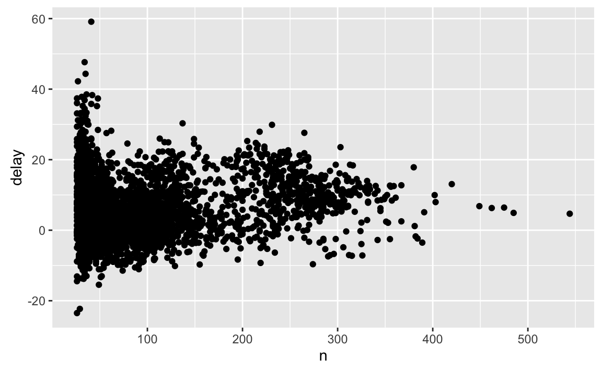

# Data transformation {#transform}

## Introduction

Visualisation is an important tool for insight generation, but it is rare that you get the data in exactly the right form you need. Often you'll need to create some new variables or summaries, or maybe you just want to rename the variables or reorder the observations in order to make the data a little easier to work with. You'll learn how to do all that (and more!) in this chapter which will teach you how to transform your data using the dplyr package and a new dataset on flights departing New York City in 2013.

### Prerequisites

In this chapter we're going to focus on how to use the dplyr package. We'll illustrate the key ideas using data from the nycflights13 package, and use ggplot2 to help us understand the data. 


```r
library(dplyr)
#> 
#> Attaching package: 'dplyr'
#> The following objects are masked from 'package:stats':
#> 
#>     filter, lag
#> The following objects are masked from 'package:base':
#> 
#>     intersect, setdiff, setequal, union
library(nycflights13)
library(ggplot2)
```

Take careful note of the message that's printed when you load dplyr - it tells you that dplyr overwrites some functions in base R. If you want to use the base version of these functions after loading dplyr, you'll need to use their full names: `stats::filter()`, `base::intersect()`, etc.

### nycflights13

To explore the basic data manipulation verbs of dplyr, we'll use `nycflights13::flights`. This data frame contains all 336,776 flights that departed from New York City in 2013. The data comes from the US [Bureau of Transportation Statistics](http://www.transtats.bts.gov/DatabaseInfo.asp?DB_ID=120&Link=0), and is documented in `?flights`.


```r
flights
#> # A tibble: 336,776 x 19
#>    year month   day dep_time sched_dep_time dep_delay arr_time
#>   <int> <int> <int>    <int>          <int>     <dbl>    <int>
#> 1  2013     1     1      517            515         2      830
#> 2  2013     1     1      533            529         4      850
#> 3  2013     1     1      542            540         2      923
#> 4  2013     1     1      544            545        -1     1004
#> 5  2013     1     1      554            600        -6      812
#> 6  2013     1     1      554            558        -4      740
#> # ... with 3.368e+05 more rows, and 12 more variables:
#> #   sched_arr_time <int>, arr_delay <dbl>, carrier <chr>, flight <int>,
#> #   tailnum <chr>, origin <chr>, dest <chr>, air_time <dbl>,
#> #   distance <dbl>, hour <dbl>, minute <dbl>, time_hour <time>
```

You might notice that this data frame prints a little differently from other data frames you might have used in the past: it only shows the first few rows and all the columns that fit on one screen. (To see the whole dataset, you can run `View(flights)` which will open the dataset in the RStudio viewer). It prints differently because it's a __tibble__. Tibbles are data frames, but slightly tweaked to work better in the tidyverse. For now, you don't need to worry about the differences; we'll come back to tibbles in more detail in [wrangle](#wrangle-intro).
 
You might also have noticed the row of three letter abbreviations under the column names. These describe the type of each variable:

* `lgl` stands for logical, vectors that contain only `TRUE` or `FALSE`.
* `int` stands for integers.
* `dbl` stands for doubles, or real numbers.
* `chr` stands for character vectors, or strings.

### Dplyr basics

In this chapter you are going to learn the five key dplyr functions that allow you to solve vast majority of your data manipulation challenges:

* Pick observations by their values (`filter()`).
* Reorder the rows (`arrange()`).
* Pick variables by their names (`select()`).
* Create new variables with functions of existing variables (`mutate()`).
* Collapse many values down to a single summary (`summarise()`).

These can all be used in conjunction with `group_by()` which changes the scope of each function from operating on the entire dataset to operating on it group-by-group. These six functions provide the verbs for a language of data manipulation.

All verbs work similarly: 

1.  The first argument is a data frame.

1.  The subsequent arguments describe what to do with the data frame. 
    You can refer to columns in the data frame directly without using `$`.

1.  The result is a new data frame.

Together these properties make it easy to chain together multiple simple steps to achieve a complex result. Let's dive in and see how these verbs work.

## Filter rows with `filter()`

`filter()` allows you to subset observations based on their values. The first argument is the name of the data frame. The second and subsequent arguments are the expressions that filter the data frame. For example, we can select all flights on January 1st with:


```r
filter(flights, month == 1, day == 1)
#> # A tibble: 842 x 19
#>    year month   day dep_time sched_dep_time dep_delay arr_time
#>   <int> <int> <int>    <int>          <int>     <dbl>    <int>
#> 1  2013     1     1      517            515         2      830
#> 2  2013     1     1      533            529         4      850
#> 3  2013     1     1      542            540         2      923
#> 4  2013     1     1      544            545        -1     1004
#> 5  2013     1     1      554            600        -6      812
#> 6  2013     1     1      554            558        -4      740
#> # ... with 836 more rows, and 12 more variables: sched_arr_time <int>,
#> #   arr_delay <dbl>, carrier <chr>, flight <int>, tailnum <chr>,
#> #   origin <chr>, dest <chr>, air_time <dbl>, distance <dbl>, hour <dbl>,
#> #   minute <dbl>, time_hour <time>
```

When you run that line of code, dplyr executes the filtering operation and returns a new data frame. dplyr functions never modify their inputs, so if you want to save the result, you'll need to use the assignment operator, `<-`:


```r
jan1 <- filter(flights, month == 1, day == 1)
```

R either prints out the results, or saves them to a variable. If you want to do both, you can wrap the assignment in parentheses:


```r
(dec25 <- filter(flights, month == 12, day == 25))
#> # A tibble: 719 x 19
#>    year month   day dep_time sched_dep_time dep_delay arr_time
#>   <int> <int> <int>    <int>          <int>     <dbl>    <int>
#> 1  2013    12    25      456            500        -4      649
#> 2  2013    12    25      524            515         9      805
#> 3  2013    12    25      542            540         2      832
#> 4  2013    12    25      546            550        -4     1022
#> 5  2013    12    25      556            600        -4      730
#> 6  2013    12    25      557            600        -3      743
#> # ... with 713 more rows, and 12 more variables: sched_arr_time <int>,
#> #   arr_delay <dbl>, carrier <chr>, flight <int>, tailnum <chr>,
#> #   origin <chr>, dest <chr>, air_time <dbl>, distance <dbl>, hour <dbl>,
#> #   minute <dbl>, time_hour <time>
```

### Comparisons

To use filtering effectively, you have to know how to select the observations that you want using the comparison operators. R provides the standard suite: `>`, `>=`, `<`, `<=`, `!=` (not equal), and `==` (equal). 

When you're starting out with R, the easiest mistake to make is to use `=` instead of `==` when testing for equality. When this happens you'll get an informative error:


```r
filter(flights, month = 1)
#> Error: filter() takes unnamed arguments. Do you need `==`?
```

There's another common problem you might encounter when using `==`: floating point numbers. These results might surprise you!


```r
sqrt(2) ^ 2 == 2
#> [1] FALSE
1/49 * 49 == 1
#> [1] FALSE
```

Computers use finite precision arithmetic (they obviously can't store an infinite number of digits!) so remember that every number you see is an approximation. Instead of relying on `==`, use use `dplyr::near()`:


```r
near(sqrt(2) ^ 2,  2)
#> [1] TRUE
near(1 / 49 * 49, 1)
#> [1] TRUE
```

(Remember that we use `::` to explicit about where a function lives. If dplyr is installed, `dplyr::near()` will always work. If you want to use the shorter `near()`, you need to make sure you have loaded dplyr with `library(dplyr)`.)

### Logical operators

Multiple arguments to `filter()` are combined with "and": every expression must be true in order for a row to be included in the output. For other types of combinations, you'll need to use Boolean operators yourself: `&` is "and", `|` is "or", and `!` is "not". Figure \@ref(fig:bool-ops) shows the complete set of Boolean operations.

<div class="figure" style="text-align: center">

<p class="caption">(\#fig:bool-ops)Complete set of boolean operations. `x` is the left-hand circle, `y` is the right hand circle, and the shaded region show which parts each operator selects.</p>
</div>

The following code finds all flights that departed in November or December:


```r
filter(flights, month == 11 | month == 12)
```

The order of operations doesn't work like English. You can't write `filter(flights, month == 11 | 12)`, which you might literally translate into  "finds all flights that departed in November or December". Instead it finds all months that equal `11 | 12`, an expression that evaluates to `TRUE`. In a numeric context (like here), `TRUE` becomes one, so this finds all flights in January, not November or December. This is quite confusing!

Sometimes you can simplify complicated subsetting by remembering De Morgan's law: `!(x & y)` is the same as `!x | !y`, and `!(x | y)` is the same as `!x & !y`. For example, if you wanted to find flights that weren't delayed (on arrival or departure) by more than two hours, you could use either of the following two filters:


```r
filter(flights, !(arr_delay > 120 | dep_delay > 120))
filter(flights, arr_delay <= 120, dep_delay <= 120)
```

As well as `&` and `|`, R also has `&&` and `||`. Don't use them here! You'll learn when you should use them in [conditional execution].

Sometimes you want to find all rows after the first `TRUE`, or all rows until the first `FALSE`. The window functions `cumany()` and `cumall()` allow you to find these values:


```r
df <- tibble(
  x = c(FALSE, TRUE, FALSE), 
  y = c(TRUE, FALSE, TRUE)
)

filter(df, cumany(x)) # all rows after first TRUE
#> # A tibble: 2 x 2
#>       x     y
#>   <lgl> <lgl>
#> 1  TRUE FALSE
#> 2 FALSE  TRUE
filter(df, cumall(y)) # all rows until first FALSE
#> # A tibble: 1 x 2
#>       x     y
#>   <lgl> <lgl>
#> 1 FALSE  TRUE
```

(`tibble()` creates a dataset "by hand". You'll learn more about it in [tibbles].)

Whenever you start using complicated, multipart expressions in `filter()`, consider making them explicit variables instead. That makes it much easier to check your work. You'll learn how to create new variables shortly.

### Missing values

One important feature of R that can make comparison tricky are missing values, or `NA`s ("not applicables"). `NA` represents an unknown value so missing values are "contagious": almost any operation involving an unknown value will also be unknown.


```r
NA > 5
#> [1] NA
10 == NA
#> [1] NA
NA + 10
#> [1] NA
NA / 2
#> [1] NA
```

The most confusing result is this one:


```r
NA == NA
#> [1] NA
```

It's easiest to understand why this is true with a bit more context:


```r
# Let x be Mary's age. We don't know how old she is.
x <- NA

# Let y be John's age. We don't know how old he is.
y <- NA

# Are John and Mary the same age?
x == y
#> [1] NA
# We don't know!
```

If you want to determine if a value is missing, use `is.na()`:


```r
is.na(x)
#> [1] TRUE
```

`filter()` only includes rows where the condition is `TRUE`; it excludes both `FALSE` and `NA` values. If you want to preserve missing values, ask for them explicitly:


```r
df <- tibble(x = c(1, NA, 3))
filter(df, x > 1)
#> # A tibble: 1 x 1
#>       x
#>   <dbl>
#> 1     3
filter(df, is.na(x) | x > 1)
#> # A tibble: 2 x 1
#>       x
#>   <dbl>
#> 1    NA
#> 2     3
```

### Exercises

1.  Find all flights that

    1. Were delayed by more two hours
    1. Flew to Houston (`IAH` or `HOU`)
    1. Were operated by United, American, or Delta
    1. Departed in summer (July, August, and September)
    1. Arrived more than two hours late, but didn't leave late
    1. Were delayed by at least an hour, but made up over 30 minutes in flight
    1. Departed between midnight and 6am (inclusive)

1.  Another useful dplyr filtering helper is `between()`. What does it do?
    Can you use it to simplify the code needed to answer the previous 
    challenges?

1.  How many flights have a missing `dep_time`? What other variables are 
    missing? What might these rows represent?

1.  Why is `NA ^ 0` not missing? Why is `NA | TRUE` not missing?
    Why is `FALSE & NA` not missing? Can you figure out the general
    rule?  (`NA * 0` is a tricky counterexample!)

## Arrange rows with `arrange()`

`arrange()` works similarly to `filter()` except that instead of selecting rows, it changes their order. It takes a data frame and a set of column names (or more complicated expressions) to order by. If you provide more than one column name, each additional column will be used to break ties in the values of preceding columns:


```r
arrange(flights, year, month, day)
#> # A tibble: 336,776 x 19
#>    year month   day dep_time sched_dep_time dep_delay arr_time
#>   <int> <int> <int>    <int>          <int>     <dbl>    <int>
#> 1  2013     1     1      517            515         2      830
#> 2  2013     1     1      533            529         4      850
#> 3  2013     1     1      542            540         2      923
#> 4  2013     1     1      544            545        -1     1004
#> 5  2013     1     1      554            600        -6      812
#> 6  2013     1     1      554            558        -4      740
#> # ... with 3.368e+05 more rows, and 12 more variables:
#> #   sched_arr_time <int>, arr_delay <dbl>, carrier <chr>, flight <int>,
#> #   tailnum <chr>, origin <chr>, dest <chr>, air_time <dbl>,
#> #   distance <dbl>, hour <dbl>, minute <dbl>, time_hour <time>
```

Use `desc()` to re-order by a column in descending order:


```r
arrange(flights, desc(arr_delay))
#> # A tibble: 336,776 x 19
#>    year month   day dep_time sched_dep_time dep_delay arr_time
#>   <int> <int> <int>    <int>          <int>     <dbl>    <int>
#> 1  2013     1     9      641            900      1301     1242
#> 2  2013     6    15     1432           1935      1137     1607
#> 3  2013     1    10     1121           1635      1126     1239
#> 4  2013     9    20     1139           1845      1014     1457
#> 5  2013     7    22      845           1600      1005     1044
#> 6  2013     4    10     1100           1900       960     1342
#> # ... with 3.368e+05 more rows, and 12 more variables:
#> #   sched_arr_time <int>, arr_delay <dbl>, carrier <chr>, flight <int>,
#> #   tailnum <chr>, origin <chr>, dest <chr>, air_time <dbl>,
#> #   distance <dbl>, hour <dbl>, minute <dbl>, time_hour <time>
```

Missing values are always sorted at the end:


```r
df <- tibble(x = c(5, 2, NA))
arrange(df, x)
#> # A tibble: 3 x 1
#>       x
#>   <dbl>
#> 1     2
#> 2     5
#> 3    NA
arrange(df, desc(x))
#> # A tibble: 3 x 1
#>       x
#>   <dbl>
#> 1     5
#> 2     2
#> 3    NA
```

### Exercises

1.  How could you use `arrange()` to sort all missing values to the start?
    (Hint: use `is.na()`).
    
1.  Sort `flights` to find the most delayed flights. Find the flights that
    left earliest.

1.  Sort `flights` to find the fastest flights.

1.  Which flights travelled the longest? Which travelled the shortest?

## Select columns with `select()` {#select}

It's not uncommon to get datasets with hundreds or even thousands of variables. In this case, the first challenge is often narrowing in on the variables you're actually interested in. `select()` allows you to rapidly zoom in on a useful subset using operations based on the names of the variables.

`select()` is not terribly useful with the flights the data because we only have 19 variables, but you can still get the general idea:


```r
# Select columns by name
select(flights, year, month, day)
#> # A tibble: 336,776 x 3
#>    year month   day
#>   <int> <int> <int>
#> 1  2013     1     1
#> 2  2013     1     1
#> 3  2013     1     1
#> 4  2013     1     1
#> 5  2013     1     1
#> 6  2013     1     1
#> # ... with 3.368e+05 more rows
# Select all columns between year and day (inclusive)
select(flights, year:day)
#> # A tibble: 336,776 x 3
#>    year month   day
#>   <int> <int> <int>
#> 1  2013     1     1
#> 2  2013     1     1
#> 3  2013     1     1
#> 4  2013     1     1
#> 5  2013     1     1
#> 6  2013     1     1
#> # ... with 3.368e+05 more rows
# Select all columns except those from year to day (inclusive)
select(flights, -(year:day))
#> # A tibble: 336,776 x 16
#>   dep_time sched_dep_time dep_delay arr_time sched_arr_time arr_delay
#>      <int>          <int>     <dbl>    <int>          <int>     <dbl>
#> 1      517            515         2      830            819        11
#> 2      533            529         4      850            830        20
#> 3      542            540         2      923            850        33
#> 4      544            545        -1     1004           1022       -18
#> 5      554            600        -6      812            837       -25
#> 6      554            558        -4      740            728        12
#> # ... with 3.368e+05 more rows, and 10 more variables: carrier <chr>,
#> #   flight <int>, tailnum <chr>, origin <chr>, dest <chr>, air_time <dbl>,
#> #   distance <dbl>, hour <dbl>, minute <dbl>, time_hour <time>
```

There are a number of helper functions you can use within `select()`:

* `starts_with("abc")`: matches names that begin with "abc".

* `ends_with("xyz")`: matches names that end with "xyz".

* `contains("ijk")`: matches names that contain "ijk".

* `matches("(.)\\1")`: selects variables that match a regular expression.
   This one matches any variables that contain repeated characters. You'll 
   learn more about regular expressions in [strings].
   
*  `num_range("x", 1:3)` matches `x1`, `x2` and `x3`.
   
See `?select` for more details.

It's possible to use `select()` to rename variables:


```r
select(flights, tail_num = tailnum)
#> # A tibble: 336,776 x 1
#>   tail_num
#>      <chr>
#> 1   N14228
#> 2   N24211
#> 3   N619AA
#> 4   N804JB
#> 5   N668DN
#> 6   N39463
#> # ... with 3.368e+05 more rows
```

But because `select()` drops all the variables not explicitly mentioned, it's not that useful. Instead, use `rename()`, which is a variant of `select()` that keeps all the variables that aren't explicitly mentioned:


```r
rename(flights, tail_num = tailnum)
#> # A tibble: 336,776 x 19
#>    year month   day dep_time sched_dep_time dep_delay arr_time
#>   <int> <int> <int>    <int>          <int>     <dbl>    <int>
#> 1  2013     1     1      517            515         2      830
#> 2  2013     1     1      533            529         4      850
#> 3  2013     1     1      542            540         2      923
#> 4  2013     1     1      544            545        -1     1004
#> 5  2013     1     1      554            600        -6      812
#> 6  2013     1     1      554            558        -4      740
#> # ... with 3.368e+05 more rows, and 12 more variables:
#> #   sched_arr_time <int>, arr_delay <dbl>, carrier <chr>, flight <int>,
#> #   tail_num <chr>, origin <chr>, dest <chr>, air_time <dbl>,
#> #   distance <dbl>, hour <dbl>, minute <dbl>, time_hour <time>
```

Another option is to use `select()` in conjunction with the `everything()` helper. This is useful if you have a handful of variables you'd like to move to the start of the data frame.


```r
select(flights, time_hour, air_time, everything())
#> # A tibble: 336,776 x 19
#>             time_hour air_time  year month   day dep_time sched_dep_time
#>                <time>    <dbl> <int> <int> <int>    <int>          <int>
#> 1 2013-01-01 05:00:00      227  2013     1     1      517            515
#> 2 2013-01-01 05:00:00      227  2013     1     1      533            529
#> 3 2013-01-01 05:00:00      160  2013     1     1      542            540
#> 4 2013-01-01 05:00:00      183  2013     1     1      544            545
#> 5 2013-01-01 06:00:00      116  2013     1     1      554            600
#> 6 2013-01-01 05:00:00      150  2013     1     1      554            558
#> # ... with 3.368e+05 more rows, and 12 more variables: dep_delay <dbl>,
#> #   arr_time <int>, sched_arr_time <int>, arr_delay <dbl>, carrier <chr>,
#> #   flight <int>, tailnum <chr>, origin <chr>, dest <chr>, distance <dbl>,
#> #   hour <dbl>, minute <dbl>
```

### Exercises

1.  Brainstorm as many ways as possible to select `dep_time`, `dep_delay`,
    `arr_time`, and `arr_delay` from `flights`.
    
1.  What happens if you include the name of a variable multiple times in
    a `select()` call?
  
1.  What does the `one_of()` function do? Why might it be helpful in conjunction
    with this vector?
    
    
    ```r
    vars <- c("year", "month", "day", "dep_delay", "arr_delay")
    ```
    
1.  Does the result of running the following code surprise you?  How do the
    select helpers deal with case by default? How can you change that default?

    
    ```r
    select(flights, contains("TIME"))
    ```

## Add new variables with `mutate()`

Besides selecting sets of existing columns, it's often useful to add new columns that are functions of existing columns. That's the job of `mutate()`. 

`mutate()` always adds new columns at the end of your dataset so we'll start by creating a narrower dataset so we can see the new variables. Remember that when you're in RStudio, the easiest way to see all the columns is `View()`.


```r
flights_sml <- select(flights, 
  year:day, 
  ends_with("delay"), 
  distance, 
  air_time
)
mutate(flights_sml,
  gain = arr_delay - dep_delay,
  speed = distance / air_time * 60
)
#> # A tibble: 336,776 x 9
#>    year month   day dep_delay arr_delay distance air_time  gain speed
#>   <int> <int> <int>     <dbl>     <dbl>    <dbl>    <dbl> <dbl> <dbl>
#> 1  2013     1     1         2        11     1400      227     9   370
#> 2  2013     1     1         4        20     1416      227    16   374
#> 3  2013     1     1         2        33     1089      160    31   408
#> 4  2013     1     1        -1       -18     1576      183   -17   517
#> 5  2013     1     1        -6       -25      762      116   -19   394
#> 6  2013     1     1        -4        12      719      150    16   288
#> # ... with 3.368e+05 more rows
```

Note that you can refer to columns that you've just created:


```r
mutate(flights_sml,
  gain = arr_delay - dep_delay,
  hours = air_time / 60,
  gain_per_hour = gain / hours
)
#> # A tibble: 336,776 x 10
#>    year month   day dep_delay arr_delay distance air_time  gain hours
#>   <int> <int> <int>     <dbl>     <dbl>    <dbl>    <dbl> <dbl> <dbl>
#> 1  2013     1     1         2        11     1400      227     9  3.78
#> 2  2013     1     1         4        20     1416      227    16  3.78
#> 3  2013     1     1         2        33     1089      160    31  2.67
#> 4  2013     1     1        -1       -18     1576      183   -17  3.05
#> 5  2013     1     1        -6       -25      762      116   -19  1.93
#> 6  2013     1     1        -4        12      719      150    16  2.50
#> # ... with 3.368e+05 more rows, and 1 more variables: gain_per_hour <dbl>
```

If you only want to keep the new variables, use `transmute()`:


```r
transmute(flights,
  gain = arr_delay - dep_delay,
  hours = air_time / 60,
  gain_per_hour = gain / hours
)
#> # A tibble: 336,776 x 3
#>    gain hours gain_per_hour
#>   <dbl> <dbl>         <dbl>
#> 1     9  3.78          2.38
#> 2    16  3.78          4.23
#> 3    31  2.67         11.62
#> 4   -17  3.05         -5.57
#> 5   -19  1.93         -9.83
#> 6    16  2.50          6.40
#> # ... with 3.368e+05 more rows
```

### Useful creation functions {#mutate-funs}

There are many functions for creating new variables that you can use with `mutate()`. The key property is that the function must be vectorised: it must take a vector of values as input, return a vector with the same number of values as output. There's no way to list every possible function that you might use, but here's a selection of functions that are frequently useful:

*   Arithmetic operators: `+`, `-`, `*`, `/`, `^`. These are all vectorised,
    using the so called "recycling rules". If one parameter is shorter than 
    the other, it will be automatically extended to be the same length. This 
    is most useful when one of the arguments is a single number: `airtime / 60`,
    `hours * 60 + minute`, etc.
    
    Arithmetic operators are also useful in conjunction with the aggregate
    functions you'll learn about later. For example, `x / sum(x)` calculates 
    the proportion of a total, and `y - mean(y)` computes the difference from 
    the mean.
    
*   Modular arithmetic: `%/%` (integer division) and `%%` (remainder), where
    `x == y * (x %/% y) + (x %% y)`. Modular arithmetic is a handy tool because 
    it allows you to break integers up into pieces. For example, in the 
    flights dataset, you can compute `hour` and `minute` from `dep_time` with:
    
    
    ```r
    transmute(flights,
      dep_time,
      hour = dep_time %/% 100,
      minute = dep_time %% 100
    )
    #> # A tibble: 336,776 x 3
    #>   dep_time  hour minute
    #>      <int> <dbl>  <dbl>
    #> 1      517     5     17
    #> 2      533     5     33
    #> 3      542     5     42
    #> 4      544     5     44
    #> 5      554     5     54
    #> 6      554     5     54
    #> # ... with 3.368e+05 more rows
    ```
  
*   Logs: `log()`, `log2()`, `log10()`. Logarithms are an incredibly useful
    transformation for dealing with data that ranges across multiple orders of
    magnitude. They also convert multiplicative relationships to additive, a
    feature we'll come back to in modelling.
    
    All else being equal, I recommend using `log2()` because it's easy to
    interpret: a difference of 1 on the log scale corresponds to doubling on
    the original scale and a difference of -1 corresponds to halving.

*   Offsets: `lead()` and `lag()` allow you to refer to leading or lagging 
    values. This allows you to compute running differences (e.g. `x - lag(x)`) 
    or find when values change (`x != lag(x))`. They are most useful in 
    conjunction with `group_by()`, which you'll learn about shortly.
    
    
    ```r
    x <- 1:10
    x
    #>  [1]  1  2  3  4  5  6  7  8  9 10
    lag(x)
    #>  [1] NA  1  2  3  4  5  6  7  8  9
    lead(x)
    #>  [1]  2  3  4  5  6  7  8  9 10 NA
    ```
  
*   Cumulative and rolling aggregates: R provides functions for running sums,
    products, mins and maxes: `cumsum()`, `cumprod()`, `cummin()`, `cummax()`; 
    and dplyr provides `cummean()` for cumulative means. If you need rolling
    aggregates (i.e. a sum computed over a rolling window), try the RcppRoll
    package.
    
    
    ```r
    x
    #>  [1]  1  2  3  4  5  6  7  8  9 10
    cumsum(x)
    #>  [1]  1  3  6 10 15 21 28 36 45 55
    cummean(x)
    #>  [1] 1.0 1.5 2.0 2.5 3.0 3.5 4.0 4.5 5.0 5.5
    ```

*   Logical comparisons, `<`, `<=`, `>`, `>=`, `!=`, which you learned about
    earlier. If you're doing a complex sequence of logical operations it's 
    often a good idea to store the interim values in new variables so you can
    check that each step is working as expected.

*   Ranking: there are a number of ranking functions, but you should 
    start with `min_rank()`. It does the most usual type of ranking 
    (e.g. 1st, 2nd, 2nd, 4th). The default gives smallest values the small
    ranks; use `desc(x)` to give the largest values the smallest ranks. 
    If `min_rank()` doesn't do what you need, look at the variants 
    `row_number()`, `dense_rank()`, `percent_rank()`, `cume_dist()`,  
    `ntile()`.
    
    
    ```r
    y <- c(1, 2, 2, NA, 3, 4)
    tibble(
      row_number(y),
      min_rank(y),
      dense_rank(y),
      percent_rank(y),
      cume_dist(y)
    ) %>% knitr::kable()
    ```
    
    
    
     row_number(y)   min_rank(y)   dense_rank(y)   percent_rank(y)   cume_dist(y)
    --------------  ------------  --------------  ----------------  -------------
                 1             1               1              0.00            0.2
                 2             2               2              0.25            0.6
                 3             2               2              0.25            0.6
                NA            NA              NA                NA             NA
                 4             4               3              0.75            0.8
                 5             5               4              1.00            1.0

### Exercises


1.  Currently `dep_time` and `sched_dep_time` are convenient to look at, but
    hard to compute with because they're not really continuous numbers. 
    Convert them to a more convenient representation of number of minutes
    since midnight.
    
1.  Compare `airtime` with `arr_time - dep_time`. What do you expect to see?
    What do you see? What do you need to do to fix it?
    
1.  Compare `dep_time`, `sched_dep_time`, and `dep_delay`. How would you
    expect those three numbers to be related?

1.  Find the 10 most delayed flights using a ranking function. How do you want 
    to handle ties? Carefully read the documentation for `min_rank()`.

1.  What does `1:3 + 1:10` return? Why?

1.  What trigonometric functions does R provide?

## Grouped summaries with `summarise()`

The last key verb is `summarise()`. It collapses a data frame to a single row:


```r
summarise(flights, delay = mean(dep_delay, na.rm = TRUE))
#> # A tibble: 1 x 1
#>   delay
#>   <dbl>
#> 1  12.6
```

(We'll come back to what that `na.rm = TRUE` means very shortly.)

`summarise()` is not terribly useful unless we pair it with `group_by()`. This changes the unit of analysis from the complete dataset to individual groups. Then, when you use the dplyr verbs on a grouped data frame they'll be automatically applied "by group". For example, if we applied exactly the same code to a data frame grouped by date, we get the average delay per date:


```r
by_day <- group_by(flights, year, month, day)
summarise(by_day, delay = mean(dep_delay, na.rm = TRUE))
#> Source: local data frame [365 x 4]
#> Groups: year, month [?]
#> 
#>    year month   day delay
#>   <int> <int> <int> <dbl>
#> 1  2013     1     1 11.55
#> 2  2013     1     2 13.86
#> 3  2013     1     3 10.99
#> 4  2013     1     4  8.95
#> 5  2013     1     5  5.73
#> 6  2013     1     6  7.15
#> # ... with 359 more rows
```

Together `group_by()` and `summarise()` provide one of the tools that you'll use most commonly when working with dplyr: grouped summaries. But before we go any further with this, we need to introduce a powerful new idea: the pipe.

### Combining multiple operations with the pipe

Imagine that we want to explore the relationship between the distance and average delay for each location. Using what you know about dplyr, you might write code like this:


```r
by_dest <- group_by(flights, dest)
delay <- summarise(by_dest,
  count = n(),
  dist = mean(distance, na.rm = TRUE),
  delay = mean(arr_delay, na.rm = TRUE)
)
delay <- filter(delay, count > 20, dest != "HNL")

# It looks like delays increase with distance up to ~750 miles 
# and then decrease. Maybe as flights get longer there's more 
# ability to make up delays in the air?
ggplot(data = delay, mapping = aes(x = dist, y = delay)) +
  geom_point(aes(size = count), alpha = 1/3) +
  geom_smooth(se = FALSE)
```


There are three steps to prepare this data:

1.  Group flights by destination.

1.  Summarise to compute distance, average delay, and number of flights.

1.  Filter to remove noisy points and Honolulu airport, which is almost
    twice as far away as the next closest airport.

This code is a little frustrating to write because we have to give each intermediate data frame a name, even though we don't care about it. Naming things is hard, so this slows down our analysis. 

There's another way to tackle the same problem with the pipe, `%>%`:


```r
delays <- flights %>% 
  group_by(dest) %>% 
  summarise(
    count = n(),
    dist = mean(distance, na.rm = TRUE),
    delay = mean(arr_delay, na.rm = TRUE)
  ) %>% 
  filter(count > 20, dest != "HNL")
```

This focuses on the transformations, not what's being transformed, which makes the code easier to read. You can read it as a series of imperative statements: group, then summarise, then filter. As suggested by this reading, a good way to pronounce `%>%` when reading code is "then".

Behind the scenes, `x %>% f(y)` turns into `f(x, y)`, and `x %>% f(y) %>% g(z)` turns into `g(f(x, y), z)` and so on. You can use the pipe to rewrite multiple operations in a way that you can read left-to-right, top-to-bottom. We'll use piping frequently from now on because it considerably improves the readability of code, and we'll come back to it in more detail in [pipes].

Working with the pipe is one of the key criteria for belonging to the tidyverse. The only exception is ggplot2: it was written before the pipe was discovered. Unfortunately, the next iteration of ggplot2, ggvis, which does use the pipe, isn't quite ready for prime time yet. 

### Missing values

You may have wondered about the `na.rm` argument we used above. What happens if we don't set it?


```r
flights %>% 
  group_by(year, month, day) %>% 
  summarise(mean = mean(dep_delay))
#> Source: local data frame [365 x 4]
#> Groups: year, month [?]
#> 
#>    year month   day  mean
#>   <int> <int> <int> <dbl>
#> 1  2013     1     1    NA
#> 2  2013     1     2    NA
#> 3  2013     1     3    NA
#> 4  2013     1     4    NA
#> 5  2013     1     5    NA
#> 6  2013     1     6    NA
#> # ... with 359 more rows
```

We get a lot of missing values! That's because aggregation functions obey the usual rule of missing values: if there's any missing value in the input, the output will be a missing value. Fortunately, all aggregation functions have an `na.rm` argument which removes the missing values prior to computation:


```r
flights %>% 
  group_by(year, month, day) %>% 
  summarise(mean = mean(dep_delay, na.rm = TRUE))
#> Source: local data frame [365 x 4]
#> Groups: year, month [?]
#> 
#>    year month   day  mean
#>   <int> <int> <int> <dbl>
#> 1  2013     1     1 11.55
#> 2  2013     1     2 13.86
#> 3  2013     1     3 10.99
#> 4  2013     1     4  8.95
#> 5  2013     1     5  5.73
#> 6  2013     1     6  7.15
#> # ... with 359 more rows
```

In this case, where missing values represent cancelled flights, we could also tackle the problem by first removing the cancelled flights. We'll save this dataset so we can reuse in the next few examples.


```r
not_cancelled <- filter(flights, !is.na(dep_delay), !is.na(arr_delay))

not_cancelled %>% 
  group_by(year, month, day) %>% 
  summarise(mean = mean(dep_delay))
#> Source: local data frame [365 x 4]
#> Groups: year, month [?]
#> 
#>    year month   day  mean
#>   <int> <int> <int> <dbl>
#> 1  2013     1     1 11.44
#> 2  2013     1     2 13.68
#> 3  2013     1     3 10.91
#> 4  2013     1     4  8.97
#> 5  2013     1     5  5.73
#> 6  2013     1     6  7.15
#> # ... with 359 more rows
```

### Counts

Whenever you do any aggregation, it's always a good idea to include either a count (`n()`), or a count of non-missing values (`sum(!is.na(x))`). That way you can check that you're not drawing conclusions based on very small amounts of data. For example, let's look at the planes (identified by their tail number) that have the highest average delays:


```r
delays <- not_cancelled %>% 
  group_by(tailnum) %>% 
  summarise(
    delay = mean(arr_delay)
  )

ggplot(data = delays, mapping = aes(x = delay)) + 
  geom_freqpoly(binwidth = 10)
```


Wow, there are some planes that have an _average_ delay of 5 hours (300 minutes)!

The story is actually a little more nuanced. We can get more insight if we draw a scatterplot of number of flights vs. average delay:


```r
delays <- not_cancelled %>% 
  group_by(tailnum) %>% 
  summarise(
    delay = mean(arr_delay, na.rm = TRUE),
    n = n()
  )

ggplot(data = delays, mapping = aes(x = n, y = delay)) + 
  geom_point()
```


Not surprisingly, there is much greater variation in the average delay when there are few flights. The shape of this plot is very characteristic: whenever you plot a mean (or other summary) vs. group size, you'll see that the variation decreases as the sample size increases.

When looking at this sort of plot, it's often useful to filter out the groups with the smallest numbers of observations, so you can see more of the pattern and less of the extreme variation in the smallest groups. This is what the following code does, as well as showing you a handy pattern for integrating ggplot2 into dplyr flows. It's a bit painful that you have to switch from `%>%` to `+`, but once you get the hang of it, it's quite convenient.


```r
delays %>% 
  filter(n > 25) %>% 
  ggplot(mapping = aes(x = n, y = delay)) + 
    geom_point()
```



--------------------------------------------------------------------------------

RStudio tip: a useful keyboard shortcut is Cmd/Ctrl + Shift + P. This resends the previously sent chunk from the editor to the console. This is very convenient when you're (e.g.) exploring the value of `n` in the example above. You send the whole block once with Cmd/Ctrl + Enter, then you modify the value of `n` and press Cmd/Ctrl + Shift + P to resend the complete block.

--------------------------------------------------------------------------------

There's another common variation of this type of pattern. Let's look at how the average performance of batters in baseball is related to the number of times they're at bat. Here I use data from the __Lahman__ package to compute the batting average (number of hits / number of attempts) of every major league baseball player.  When I plot the skill of the batter against the number of times batted, you see two patterns:

1.  As above, the variation in our aggregate decreases as we get more 
    data points.
    
2.  There's a positive correlation between skill (batting average, `ba`) and 
    number of opportunities to hit the ball (at bat, `ab`). This is because
    teams control who gets to play, and obviously they'll pick their best
    players.


```r
# Convert to a tibble so it prints nicely
batting <- tibble::as_tibble(Lahman::Batting)

batters <- batting %>% 
  group_by(playerID) %>% 
  summarise(
    ba = sum(H, na.rm = TRUE) / sum(AB, na.rm = TRUE),
    ab = sum(AB, na.rm = TRUE)
  )

batters %>% 
  filter(ab > 100) %>% 
  ggplot(mapping = aes(x = ab, y = ba)) +
    geom_point() + 
    geom_smooth(se = FALSE)
```


This also has important implications for ranking. If you naively sort on `desc(ba)`, the people with the best batting averages are clearly lucky, not skilled:


```r
batters %>% arrange(desc(ba))
#> # A tibble: 18,405 x 3
#>    playerID    ba    ab
#>       <chr> <dbl> <int>
#> 1 abramge01     1     1
#> 2 banisje01     1     1
#> 3 bartocl01     1     1
#> 4  bassdo01     1     1
#> 5 birasst01     1     2
#> 6 bruneju01     1     1
#> # ... with 1.84e+04 more rows
```

You can find a good explanation of this problem at <http://varianceexplained.org/r/empirical_bayes_baseball/> and <http://www.evanmiller.org/how-not-to-sort-by-average-rating.html>.

### Useful summary functions {#summarise-funs}

Just using means, counts, and sum can get you a long way, but R provides many other useful summary functions:

*   Measures of location: we've used `mean(x)`, but `median(x)` is also
    useful. The mean is the sum divided by the length; the median is a value 
    where 50% of `x` is above it, and 50% is below it.
    
    It's sometimes useful to combine aggregation with logical subsetting. 
    We haven't talked about this sort of subsetting yet, but you'll learn more
    about it in [subsetting].
    
    
    ```r
    not_cancelled %>% 
      group_by(year, month, day) %>% 
      summarise(
        avg_delay1 = mean(arr_delay),
        avg_delay2 = mean(arr_delay[arr_delay > 0]) # the average positive delay
      )
    #> Source: local data frame [365 x 5]
    #> Groups: year, month [?]
    #> 
    #>    year month   day avg_delay1 avg_delay2
    #>   <int> <int> <int>      <dbl>      <dbl>
    #> 1  2013     1     1      12.65       32.5
    #> 2  2013     1     2      12.69       32.0
    #> 3  2013     1     3       5.73       27.7
    #> 4  2013     1     4      -1.93       28.3
    #> 5  2013     1     5      -1.53       22.6
    #> 6  2013     1     6       4.24       24.4
    #> # ... with 359 more rows
    ```

*   Measures of spread: `sd(x)`, `IQR(x)`, `mad(x)`. The mean squared deviation,
    or standard deviation or sd for short, is the standard measure of spread.
    The interquartile range `IQR()` and median absolute deviation `mad(x)`
    are robust equivalents that maybe more useful if you have outliers.
    
    
    ```r
    # Why is distance to some destinations more variable than to others?
    not_cancelled %>% 
      group_by(dest) %>% 
      summarise(distance_sd = sd(distance)) %>% 
      arrange(desc(distance_sd))
    #> # A tibble: 104 x 2
    #>    dest distance_sd
    #>   <chr>       <dbl>
    #> 1   EGE       10.54
    #> 2   SAN       10.35
    #> 3   SFO       10.22
    #> 4   HNL       10.00
    #> 5   SEA        9.98
    #> 6   LAS        9.91
    #> # ... with 98 more rows
    ```
  
*   Measures of rank: `min(x)`, `quantile(x, 0.25)`, `max(x)`. Quantiles
    are a generalisation of the median. For example, `quantile(x, 0.25)`
    will find a value of `x` that is greater than 25% of the values,
    and less than the remaining 75%.

    
    ```r
    # When do the first and last flights leave each day?
    not_cancelled %>% 
      group_by(year, month, day) %>% 
      summarise(
        first = min(dep_time),
        last = max(dep_time)
      )
    #> Source: local data frame [365 x 5]
    #> Groups: year, month [?]
    #> 
    #>    year month   day first  last
    #>   <int> <int> <int> <int> <int>
    #> 1  2013     1     1   517  2356
    #> 2  2013     1     2    42  2354
    #> 3  2013     1     3    32  2349
    #> 4  2013     1     4    25  2358
    #> 5  2013     1     5    14  2357
    #> 6  2013     1     6    16  2355
    #> # ... with 359 more rows
    ```
  
*   Measures of position: `first(x)`, `nth(x, 2)`, `last(x)`. These work 
    similarly to `x[1]`, `x[2]`, and `x[length(x)]` but let you set a default 
    value if that position does not exist (i.e. you're trying to get the 3rd
    element from a group that only has two elements). 
    
    These functions are complementary to filtering on ranks. Filtering gives
    you all variables, with each observation in a separate row. Summarising
    gives you one row per group, with multiple variables:
    
    
    ```r
    not_cancelled %>% 
      group_by(year, month, day) %>% 
      mutate(r = min_rank(desc(dep_time))) %>% 
      filter(r %in% range(r))
    #> Source: local data frame [770 x 20]
    #> Groups: year, month, day [365]
    #> 
    #>    year month   day dep_time sched_dep_time dep_delay arr_time
    #>   <int> <int> <int>    <int>          <int>     <dbl>    <int>
    #> 1  2013     1     1      517            515         2      830
    #> 2  2013     1     1     2356           2359        -3      425
    #> 3  2013     1     2       42           2359        43      518
    #> 4  2013     1     2     2354           2359        -5      413
    #> 5  2013     1     3       32           2359        33      504
    #> 6  2013     1     3     2349           2359       -10      434
    #> # ... with 764 more rows, and 13 more variables: sched_arr_time <int>,
    #> #   arr_delay <dbl>, carrier <chr>, flight <int>, tailnum <chr>,
    #> #   origin <chr>, dest <chr>, air_time <dbl>, distance <dbl>, hour <dbl>,
    #> #   minute <dbl>, time_hour <time>, r <int>
    
    not_cancelled %>% 
      group_by(year, month, day) %>% 
      summarise(
        first_dep = first(dep_time), 
        last_dep = last(dep_time)
      )
    #> Source: local data frame [365 x 5]
    #> Groups: year, month [?]
    #> 
    #>    year month   day first_dep last_dep
    #>   <int> <int> <int>     <int>    <int>
    #> 1  2013     1     1       517     2356
    #> 2  2013     1     2        42     2354
    #> 3  2013     1     3        32     2349
    #> 4  2013     1     4        25     2358
    #> 5  2013     1     5        14     2357
    #> 6  2013     1     6        16     2355
    #> # ... with 359 more rows
    ```

*   Counts: You've seen `n()`, which takes no arguments, and returns the 
    size of the current group. To count the number of non-missing values, use
    `sum(!is.na(x))`. To count the number of distinct (unique) values, use
    `n_distinct(x)`.
    
    
    ```r
    # Which destinations have the most carriers?
    not_cancelled %>% 
      group_by(dest) %>% 
      summarise(carriers = n_distinct(carrier)) %>% 
      arrange(desc(carriers))
    #> # A tibble: 104 x 2
    #>    dest carriers
    #>   <chr>    <int>
    #> 1   ATL        7
    #> 2   BOS        7
    #> 3   CLT        7
    #> 4   ORD        7
    #> 5   TPA        7
    #> 6   AUS        6
    #> # ... with 98 more rows
    ```
    
    Counts are so useful that dplyr provides a simple helper if all you want is 
    a count:
    
    
    ```r
    not_cancelled %>% count(dest)
    #> # A tibble: 104 x 2
    #>    dest     n
    #>   <chr> <int>
    #> 1   ABQ   254
    #> 2   ACK   264
    #> 3   ALB   418
    #> 4   ANC     8
    #> 5   ATL 16837
    #> 6   AUS  2411
    #> # ... with 98 more rows
    ```
    
    You can optionally provide a weight variable. For example, you could use 
    this to "count" (sum) the total number of miles a plane flew:
    
    
    ```r
    not_cancelled %>% 
      count(tailnum, wt = distance)
    #> # A tibble: 4,037 x 2
    #>   tailnum      n
    #>     <chr>  <dbl>
    #> 1  D942DN   3418
    #> 2  N0EGMQ 239143
    #> 3  N10156 109664
    #> 4  N102UW  25722
    #> 5  N103US  24619
    #> 6  N104UW  24616
    #> # ... with 4,031 more rows
    ```
  
*   Counts and proportions of logical values: `sum(x > 10)`, `mean(y == 0)`.
    When used with numeric functions, `TRUE` is converted to 1 and `FALSE` to 0. 
    This makes `sum()` and `mean()` very useful: `sum(x)` gives the number of 
    `TRUE`s in `x`, and `mean(x)` gives the proportion.
    
    
    ```r
    # How many flights left before 5am? (these usually indicate delayed
    # flights from the previous day)
    not_cancelled %>% 
      group_by(year, month, day) %>% 
      summarise(n_early = sum(dep_time < 500))
    #> Source: local data frame [365 x 4]
    #> Groups: year, month [?]
    #> 
    #>    year month   day n_early
    #>   <int> <int> <int>   <int>
    #> 1  2013     1     1       0
    #> 2  2013     1     2       3
    #> 3  2013     1     3       4
    #> 4  2013     1     4       3
    #> 5  2013     1     5       3
    #> 6  2013     1     6       2
    #> # ... with 359 more rows
    
    # What proportion of flights are delayed by more than an hour?
    not_cancelled %>% 
      group_by(year, month, day) %>% 
      summarise(hour_perc = mean(arr_delay > 60, na.rm = TRUE))
    #> Source: local data frame [365 x 4]
    #> Groups: year, month [?]
    #> 
    #>    year month   day hour_perc
    #>   <int> <int> <int>     <dbl>
    #> 1  2013     1     1    0.0722
    #> 2  2013     1     2    0.0851
    #> 3  2013     1     3    0.0567
    #> 4  2013     1     4    0.0396
    #> 5  2013     1     5    0.0349
    #> 6  2013     1     6    0.0470
    #> # ... with 359 more rows
    ```

### Grouping by multiple variables

When you group by multiple variables, each summary peels off one level of the grouping. That makes it easy to progressively roll-up a dataset:


```r
daily <- group_by(flights, year, month, day)
(per_day   <- summarise(daily, flights = n()))
#> Source: local data frame [365 x 4]
#> Groups: year, month [?]
#> 
#>    year month   day flights
#>   <int> <int> <int>   <int>
#> 1  2013     1     1     842
#> 2  2013     1     2     943
#> 3  2013     1     3     914
#> 4  2013     1     4     915
#> 5  2013     1     5     720
#> 6  2013     1     6     832
#> # ... with 359 more rows
(per_month <- summarise(per_day, flights = sum(flights)))
#> Source: local data frame [12 x 3]
#> Groups: year [?]
#> 
#>    year month flights
#>   <int> <int>   <int>
#> 1  2013     1   27004
#> 2  2013     2   24951
#> 3  2013     3   28834
#> 4  2013     4   28330
#> 5  2013     5   28796
#> 6  2013     6   28243
#> # ... with 6 more rows
(per_year  <- summarise(per_month, flights = sum(flights)))
#> # A tibble: 1 x 2
#>    year flights
#>   <int>   <int>
#> 1  2013  336776
```

Be careful when progressively rolling up summaries: it's OK for sums and counts, but you need to think about weighting means and variances, and it's not possible to do it exactly for rank-based statistics like the median. In other words, the sum of groupwise sums is the overall sum, but the median of groupwise medians is not the overall median.

### Ungrouping

If you need to remove grouping, and return to operations on ungrouped data, use `ungroup()`. 


```r
daily %>% 
  ungroup() %>%             # no longer grouped by date
  summarise(flights = n())  # all flights
#> # A tibble: 1 x 1
#>   flights
#>     <int>
#> 1  336776
```

### Exercises

1.  Brainstorm at least 5 different ways to assess the typical delay 
    characteristics of a group of flights. Consider the following scenarios:
    
    * A flight is 15 minutes early 50% of the time, and 15 minutes late 50% of 
      the time.
      
    * A flight is always 10 minutes late.

    * A flight is 30 minutes early 50% of the time, and 30 minutes late 50% of 
      the time.
      
    * 99% of the time a flight is on time. 1% of the time it's 2 hours late.
    
    Which is more important: arrival delay or departure delay?

1.  Our definition of cancelled flights (`!is.na(dep_delay) & !is.na(arr_delay)`
    ) is slightly suboptimal. Why? Which is the most important column?

1.  Look at the number of cancelled flights per day. Is there a pattern?
    Is the proportion of cancelled flights related to the average delay?

1.  Which carrier has the worst delays? Challenge: can you disentangle the
    effects of bad airports vs. bad carriers? Why/why not? (Hint: think about
    `flights %>% group_by(carrier, dest) %>% summarise(n())`)

1.  For each plane, count the number of flights before the first delay 
    of greater than 1 hour.

1.  What does the `sort` argument to `count()` do. When might you use it?

## Grouped mutates (and filters)

Grouping is most useful in conjunction with `summarise()`, but you can also do convenient operations with `mutate()` and `filter()`:

*   Find the worst members of each group:

    
    ```r
    flights_sml %>% 
      group_by(year, month, day) %>%
      filter(rank(desc(arr_delay)) < 10)
    #> Source: local data frame [3,306 x 7]
    #> Groups: year, month, day [365]
    #> 
    #>    year month   day dep_delay arr_delay distance air_time
    #>   <int> <int> <int>     <dbl>     <dbl>    <dbl>    <dbl>
    #> 1  2013     1     1       853       851      184       41
    #> 2  2013     1     1       290       338     1134      213
    #> 3  2013     1     1       260       263      266       46
    #> 4  2013     1     1       157       174      213       60
    #> 5  2013     1     1       216       222      708      121
    #> 6  2013     1     1       255       250      589      115
    #> # ... with 3,300 more rows
    ```

*   Find all groups bigger than a threshold:

    
    ```r
    popular_dests <- flights %>% 
      group_by(dest) %>% 
      filter(n() > 365)
    ```

*   Standardise to compute per group metrics:

    
    ```r
    popular_dests %>% 
      filter(arr_delay > 0) %>% 
      mutate(prop_delay = arr_delay / sum(arr_delay)) %>% 
      select(year:day, dest, arr_delay, prop_delay)
    #> Source: local data frame [131,106 x 6]
    #> Groups: dest [77]
    #> 
    #>    year month   day  dest arr_delay prop_delay
    #>   <int> <int> <int> <chr>     <dbl>      <dbl>
    #> 1  2013     1     1   IAH        11   1.11e-04
    #> 2  2013     1     1   IAH        20   2.01e-04
    #> 3  2013     1     1   MIA        33   2.35e-04
    #> 4  2013     1     1   ORD        12   4.24e-05
    #> 5  2013     1     1   FLL        19   9.38e-05
    #> 6  2013     1     1   ORD         8   2.83e-05
    #> # ... with 1.311e+05 more rows
    ```

A grouped filter is a grouped mutate followed by an ungrouped filter. I generally avoid them except for quick and dirty manipulations: otherwise it's hard to check that you've done the manipulation correctly.

Functions that work most naturally in grouped mutates and filters are known as  window functions (vs. the summary functions used for summaries). You can learn more about useful window functions in the corresponding vignette: `vignette("window-functions")`.

### Exercises

1.  Refer back to the table of useful mutate and filtering functions. 
    Describe how each operation changes when you combine it with grouping.

1.  Which plane (`tailnum`) has the worst on-time record?

1.  What time of day should you fly if you want to avoid delays as much
    as possible?
    
1.  Delays are typically temporally correlated: even once the problem that
    caused the initial delay has been resolved, later flights are delayed 
    to allow earlier flights to leave. Using `lag()` explore how the delay
    of a flight is related to the delay of the immediately preceding flight.
    
1.  Look at each destination. Can you find flights that are suspiciously
    fast? (i.e. flights that represent a potential data entry error). Compute
    the air time a flight relative to the shortest flight to that destination.
    Which flights were most delayed in the air?
    
1.  Find all destinations that are flown by at least two carriers. Use that
    information to rank the carriers.
